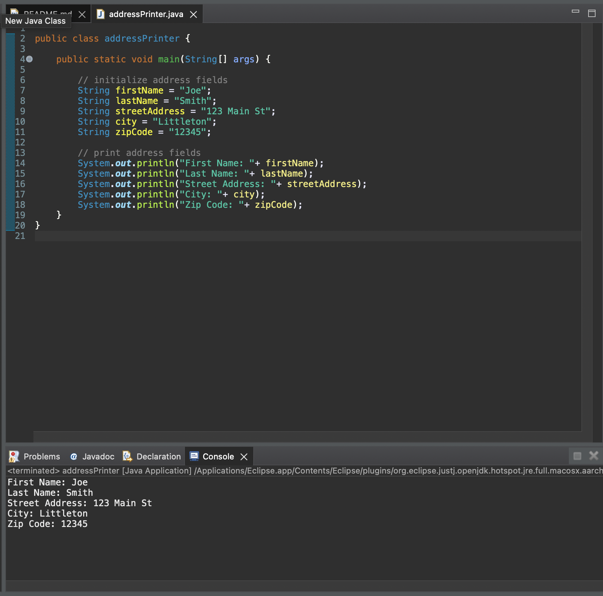

# Module 1 Critical Thinking Assignment: Option 1 - Address Information
Demonstrate understanding of basic programming concepts by creating a simple Java Application that prints an individual's address.

## Pseudocode
```
define addressPrinter class:
 	define main method:
		initialize and assign values to string fields:
			firstName
			lastName
			streetAddress
			city
			zipCode 
			
for field in field list:
 	print on newline (field)
```
## Source Code
```java
public class addressPrinter {

	public static void main(String[] args) {
		
		// initialize address fields
		String firstName = "Joe";
		String lastName = "Smith";
		String streetAddress = "123 Main St";
		String city = "Littleton";
		String zipCode = "12345";
			
		// print address fields		
		System.out.println("First Name: "+ firstName);
		System.out.println("Last Name: "+ lastName);
		System.out.println("Street Address: "+ streetAddress);
		System.out.println("City: "+ city);
		System.out.println("Zip Code: "+ zipCode);
	}
}
```

## Result
```
First Name: Joe
Last Name: Smith
Street Address: 123 Main St
City: Littleton
Zip Code: 12345
```
## Screenshot of Execution


## Git Repo path
[https://github.com/corwin-bell/programming-1-csu.git](https://github.com/corwin-bell/programming-1-csu.git) 
