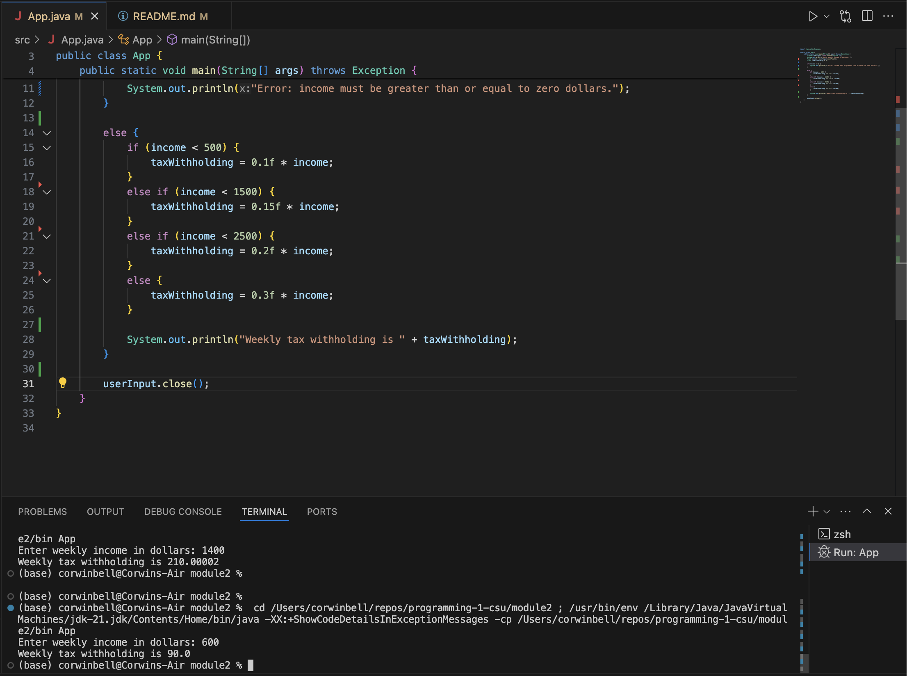
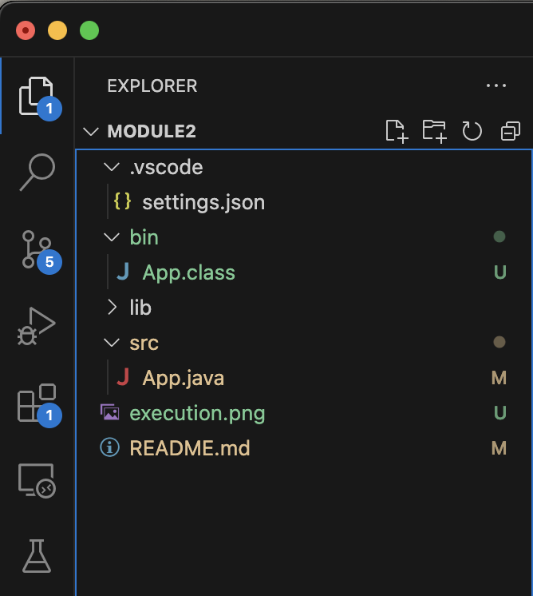

Student: Corwin Bell <br>
Course: Programming 1 <br>
Instructor: Farhad Bari <br>
5/30/2024
# Module 2 Critical Thinking Assignment: Option 1 - Calculate Average Withholding
Create a program that will calculate the weekly average tax withholding for a customer given the following weekly income guidelines:
- Income less than $500: tax rate 10%
- Incomes greater than/equal to $500 and less than $1500: tax rate 15%
- Incomes greater than/equal to $1500 and less than $2500: tax rate 20%
- Incomes greater than/equal to $2500: tax rate 30%
## Pseudocode
```
Declare class:
	Declare main method:
		Declare float income field
		Assign income field from user input
		Declare float taxWithholding field
		If income less than 0:
			Print income must be greater than or equal to zero
		Else if income less than 500:
			Assign taxWithholding to 0.10 * income
		Else if income less than 1500:
			Assign taxWithholding to 0.15 * income
		Else if income less than 2500:
			Assign taxWithholding to 0.20 * income
		Else:
			Assign taxWithholding to 0.30 * income
		Print taxWithholding
```
## Source Code
```java
import java.util.Scanner;

public class App {
    public static void main(String[] args) throws Exception {
        Scanner userInput = new Scanner(System.in);
        System.out.print("Enter weekly income in dollars: ");
        float income = userInput.nextFloat();
        float taxWithholding = 0;

        if (income < 0) {
            System.out.println("Error: income must be greater than or equal to zero dollars.");
        }

        else {
            if (income < 500) {
                taxWithholding = 0.1f * income;
            }
            else if (income < 1500) {
                taxWithholding = 0.15f * income;
            }
            else if (income < 2500) {
                taxWithholding = 0.2f * income;
            }
            else {
                taxWithholding = 0.3f * income;
            }
            
            System.out.println("Weekly tax withholding is " + taxWithholding);
        }

        userInput.close();
    }
}
```

## Result
```
Input: Enter weekly income in dollars: 600
Output: Weekly tax withholding is 90.0
```
## Screenshot of Execution


## Git Repo path and project folder Screenshot
[https://github.com/corwin-bell/programming-1-csu.git](https://github.com/corwin-bell/programming-1-csu.git)


converted to PDF using [md-to-pdf](https://github.com/simonhaenisch/md-to-pdf)
