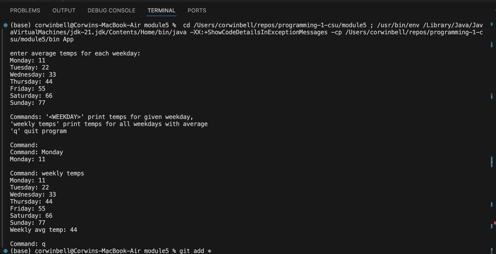
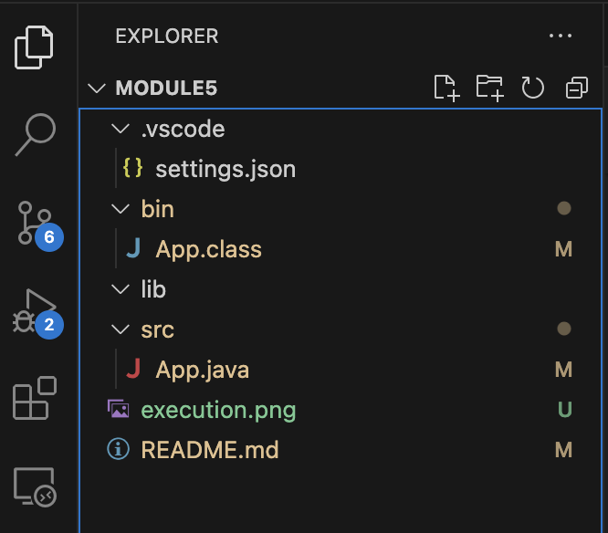

Student: Corwin Bell <br>
Course: Programming 1 <br>
Instructor: Farhad Bari <br>
6/15/2024
# Module 5 Critical Thinking Assignment: Option 1 - Get Weekly Temperatures
[Git Project Folder](https://github.com/corwin-bell/programming-1-csu/tree/main/module5) <br>
Develop a Java program that will store data in the form of daily average temperatures for one week. Store the day and average temperature in two different arrays. Your program should prompt the user for the day of the week (Monday through Sunday) and display both the day and temperature for each day. If "week" is entered, the output for your program should provide the temperature for each day and the weekly average.
## Pseudocode
```
Declare class:
	Declare main method:
        Declare variables:
            Weekdays array
            Daily temperature array
            Scanner for user input
            String to store user input
        Ask user to input temperatures for each day
        Print guidance for how to view temperatue data
        While loop to allow repeated viewing of temperature data until user quits loop
            if user inputs 'weekly temps', display temps by day and weekly average
            else, display temps for specific day desired
```
## Source Code
```java
import java.util.Scanner;

 public class App {
    public static void main(String[] args) throws Exception {
        final int DAYS_PER_WEEK = 7;
        String[] weekDays = {
            "Monday",
            "Tuesday",
            "Wednesday",
            "Thursday",
            "Friday",
            "Saturday",
            "Sunday"
        };
        int[] avgTemps = new int[DAYS_PER_WEEK];
        Scanner scnr = new Scanner(System.in);
        String userInput = "-";

        System.out.println("\nenter average temps for each weekday: ");
        for (int i = 0; i < weekDays.length; i++) {
            System.out.print(weekDays[i] + ": ");
            avgTemps[i] = scnr.nextInt();
        }
        
        System.out.println("\nCommands: '<WEEKDAY>' print temps for given weekday,");
        System.out.println("'weekly temps' print temps for all weekdays with average");
        System.out.println("'q' quit program");
        while (!userInput.equalsIgnoreCase("q")) {
            System.out.print("\nCommand: ");
            userInput = scnr.nextLine();
            
            // if user inputs "weekly temps"; display temps by day and weekly average
            if (userInput.equalsIgnoreCase("weekly temps")) {
                int tempSum = 0;
                for (int i = 0; i < weekDays.length; i++) {
                    System.out.printf("%s: %d %n", weekDays[i], avgTemps[i]);
                    tempSum += avgTemps[i];
                }
                System.out.printf("Weekly avg temp: %d %n", tempSum/DAYS_PER_WEEK);
            }
            
            // else, if user inputs a day of week, display temps for that week day
            else {
                for (int i = 0; i < weekDays.length; i++) {
                    if (userInput.equalsIgnoreCase(weekDays[i])) {
                        System.out.printf("%s: %d %n", weekDays[i], avgTemps[i]);
                        break; // exit loop once a match is found
                    }
                }
            }
        }
        scnr.close();
    }      
}
```

## Result
### Input Example
```
enter average temps for each weekday: 
Monday: 11
Tuesday: 22
Wednesday: 33
Thursday: 44
Friday: 55
Saturday: 66
Sunday: 77
```
### Output Example
```
Commands: '<WEEKDAY>' print temps for given weekday,
'weekly temps' print temps for all weekdays with average
'q' quit program

Command: weekly temps
Monday: 11 
Tuesday: 22 
Wednesday: 33 
Thursday: 44 
Friday: 55 
Saturday: 66 
Sunday: 77 
Weekly avg temp: 44

```
## Screenshot of Execution


## Git Repo path and project folder Screenshot
[https://github.com/corwin-bell/programming-1-csu.git](https://github.com/corwin-bell/programming-1-csu.git)


converted to PDF using [md-to-pdf](https://github.com/simonhaenisch/md-to-pdf)
