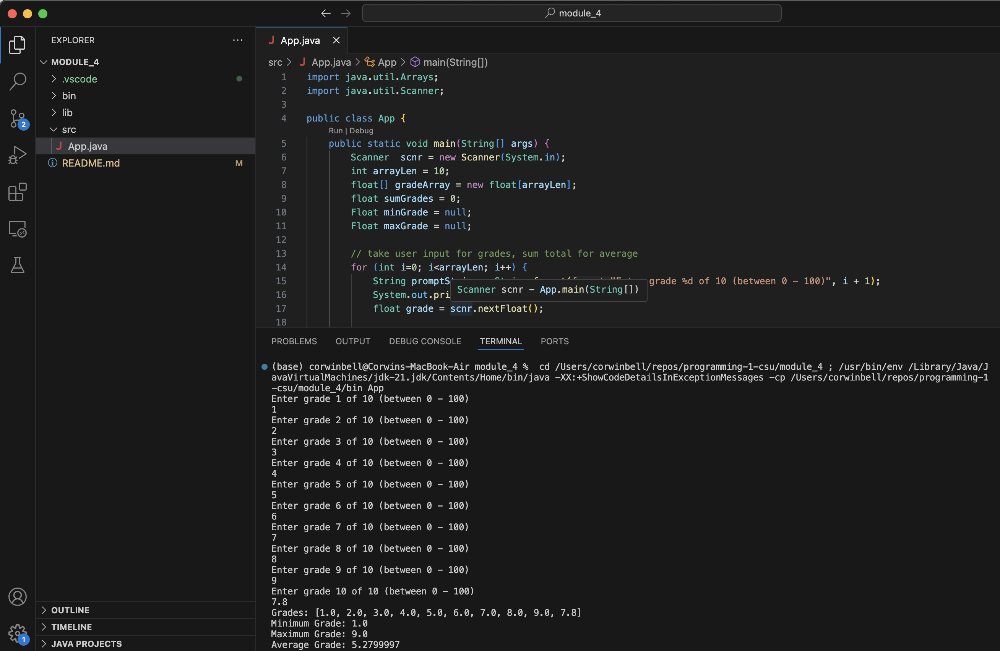
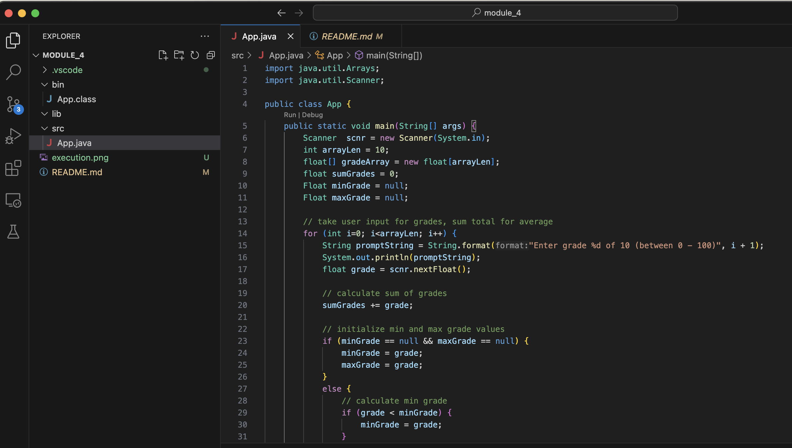

Student: Corwin Bell <br>
Course: Programming 1 <br>
Instructor: Farhad Bari <br>
6/08/2024
# Module 4 Critical Thinking Assignment: Option 2 - Capture Grade Statistics using For Loop
[Git Project Folder](https://github.com/corwin-bell/programming-1-csu/tree/main/module_4) <br>
Write a program that will provide important statistics for the grades in a class. The program will utilize a for-loop to read ten floating-point grades from user input. Include code to prevent an endless loop. Ask the user to enter the values, then print the following data:
- Average
- Maximum
- Minimum

## Pseudocode
```
Declare class:
	Declare main method:
        Declare variables:
            user input scanner
            array to store grades
            floats for total, min, max, and average
		Define ten iteration for-loop:
            get grade from user
            add grade to total
            if grade is lowest, assign to min
            if grade is highest, assign to max
            add grade to grade array
        calculate average grade
        print summary statistics to console:
            array of grades
            minimum grade
            maximum grade
            average grade
```
## Source Code
```java
import java.util.Arrays;
import java.util.Scanner;

public class App {
    public static void main(String[] args) {
        Scanner  scnr = new Scanner(System.in);
        int arrayLen = 10;
        float[] gradeArray = new float[arrayLen];
        float sumGrades = 0;
        Float minGrade = null;
        Float maxGrade = null;

        // take user input for grades, sum total for average
        for (int i=0; i<arrayLen; i++) {
            String promptString = String.format("Enter grade %d of 10 (between 0 - 100)", i + 1);
            System.out.println(promptString);
            float grade = scnr.nextFloat(); 
            
            // calculate sum of grades
            sumGrades += grade;

            // initialize min and max grade values
            if (minGrade == null && maxGrade == null) {
                minGrade = grade;
                maxGrade = grade;
            }
            else {
                // calculate min grade
                if (grade < minGrade) {
                    minGrade = grade;
                }
    
                // calculate max grade
                if (grade > maxGrade) {
                    maxGrade = grade;
                }
            } 
            // add to array of grades for verification
            gradeArray[i] = grade;  
        }

        // calculate average grade
        float avgGrade = sumGrades/arrayLen;
        
        // print results to console
        System.out.println("Grades: " + Arrays.toString(gradeArray));
        System.out.println("Minimum Grade: " + Float.toString(minGrade));
        System.out.println("Maximum Grade: " + Float.toString(maxGrade));
        System.out.println("Average Grade: " + Float.toString(avgGrade));

        scnr.close();
    }
}
```

## Result
### Input Example
```
Enter grade 10 of 10 (between 0 - 100)
7.8
```
### Output Example
```
Grades: [1.0, 2.0, 3.0, 4.0, 5.0, 6.0, 7.0, 8.0, 9.0, 7.8]
Minimum Grade: 1.0
Maximum Grade: 9.0
Average Grade: 5.2799997
```
## Screenshot of Execution


## Git Repo path and project folder Screenshot
[https://github.com/corwin-bell/programming-1-csu.git](https://github.com/corwin-bell/programming-1-csu.git)


converted to PDF using [md-to-pdf](https://github.com/simonhaenisch/md-to-pdf)
