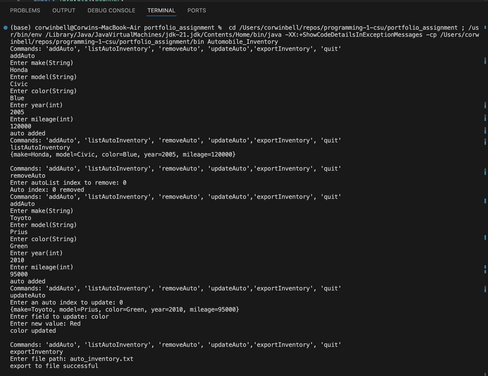
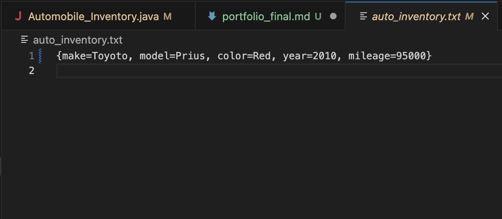

Student: Corwin Bell <br>
Course: Programming 1 <br>
Instructor: Farhad Bari <br>
7/7/2024
# Module 8 Portfolio Project: Option 1 - Automobile Inventory
[Git Project Folder](https://github.com/corwin-bell/programming-1-csu/tree/main/portfolio_assignment) <br>
Create an automobile class that will be used by a dealership as a vehicle inventory program.

## Module 1-6 Review
All my critical thinking assigments were thoroughly tested and worked as expected in my feedback from Mr. Bari so I am not resubmitting them here.

## Final Reflection
As someone who has experience programming but had never used Java, this course was a great refresher on some universal programming concepts as well as some of the specific features of Java. The first four modules of the course focused primarily on concepts I was familiar with from past programming experience in Python, R, and C. These included variables, data types, decision control structures (if statements), and repetition control structures (loops). The remaining modules included some concepts I was familiar with such as arrays and methods but in a more Java-specific framework. There were also some topics that I had briefly touched on, including classes and memory management, but now have a much better grasp of. I will reflect on what I learned throughout the Programming 1 course by highlighting key insights from each module.

As I mentioned in the introduction, the first module reinforced some important universal concepts in programming such as version control with Git. I appreciate that version control applies to any programming project regardless of the languages used, so every course that requires Git is a good opportunity to strengthen my version control skills. The strict typing and memory allocation requirements of Java make it a great language to learn programming fundamentals. While some more popular high-level languages that I may use in the future, such as Python, abstract a lot of this away, knowing that these concepts are operating under the hood will make me a better programmer. The Java Virtual Machine makes programming in Java much more portable than some other languages that require a tight coupling with low-level machine code. This explains why Google Android development is done in Java since it has to work with so many different hardware platforms.

In the second module we went over the concept of a variable, primitive data types, and getting user input with the Scanner class. It was helpful to cover specific steps of variable creation including declaration, instantiation, and initialization. I had typically always done these in one step and not really thought much about what each does before this course. The review of primitive data types, their memory size requirements, and specific applications was a helpful refresher on when to use a given type for a given use case. For example, integers are more than sufficient to store variables for numeric quantities that will never exceed a known range such as 365 days in a year but will be insufficient for storing the GDPs of countries which can be in the trillions of dollars. Lastly, introducing the Scanner class was very helpful for creating programs with a simple command line interface. The Scanner class allowed us to test program logic in a dynamic environment without needing to develop more complicated user interfaces.

The 3rd module on decision control structures was largely review for me since Python uses most of the same if-statement and loop conventions. That said, Switch statements were new for me and provide a useful framework for evaluating a variable with a series of values. One key difference between Python and Java is evaluating equality of strings for boolean expressions. Python treats strings more like a primitive data type, allowing direct equality comparison using the == operator, while Java treats a string as a pointer to the first character of a char array requiring special methods to compare the value of two strings. This feature of Java forced me to develop a deeper understanding of what a string represents. 

Most of my previous experience with looping was in a data analysis context where the number of iterations needed is typically determined by the size of a data structure you are looping over. Thus, I primarily used For-Loops for my work. Through module 4 on repetition control structures I was able to appreciate the value of While-Loops for more dynamic repetition control of simple programs that require user input; allowing a program to run until the user explicitly opts to “quit” the program. One nice loop feature that Java provides that Python does not is the Do-While loop. It’s an elegant solution to ensuring loop code runs at least once in your program and I was able to incorporate it in my final project.

Module five’s focus on array and array list types helped me appreciate the underlying features of each data structure. In Python, I was only exposed to lists which I treated as arrays most of the time. Learning how arrays and lists interact with memory, arrays occupying a fixed sequence of memory addresses and lists containing a more flexible structure of pointers to subsequent elements, improved my understanding of when to use each structure to optimize program performance. For example, I know I can rely on arrays for use cases where the length is unlikely to change such as storing data values for each day in a seven-day week, while array-lists are better for use cases where new elements are continuously added to an existing array such as a log, and finally linked-lists are better where insertions and deletions are more common such as in a customer service request queue.

Module six’s focus on methods helped clarify my understanding of functions, methods, and the relationship to classes. Coming from Python and C, I was exposed to functions which share a lot with methods but are not declared within a class. In Python I used methods all the time when importing libraries that others had created but never created my own. It was helpful to create my own methods in the context of a class. This module also exposed me to exception handling concepts such as try, catch, finally, and try-with-resources. I particularly appreciate the simplicity of try-with-resources for ensuring all open streams are closed when a program is done running. There is still a lot to learn about exception handling, such as what level of the program to include try-catch blocks, and how many specific exceptions to catch. It seems like proper exception handling is as much art as science as it can be easy to under and over do exception handling constructs.

The most informative part of Module seven for me was the content about memory areas, garbage collection, and memory leaks. I had heard of stack and heap before but was unclear what they meant in the Java context. It was helpful to learn that variables and primitive data types are stored on the stack for each thread and that more complex objects are stored on the heap regardless of which thread the variable reference is coming from. I can now see more clearly why it’s important to minimize persistent variable and object creation to optimize memory use. Garbage collection is a powerful part of Java and it was useful to learn about explicit dereferencing and local in-method variable creation to ensure objects are eligible for garbage collection.

Classes had been a topic just beyond my understanding given my previous programming experience was primarily limited to analysis and scripting of tabular data. Module 8 gave me foundational knowledge of classes, their components, and best practices to ensure proper code development. I now feel comfortable creating my own classes thinking through what should be included in each and how they should relate to each other through inheritance and references. At first I thought creating fields along with their associated getters and setters was cumbersome but I now appreciate the control this gives the programmer to set special rules that would not be possible with direct field access. I had heard of unit testing before but now feel confident that I could build a basic testbench for classes I create by testing all methods for typical and edge cases. Lastly, the JavaDoc API is a great way to create maintainable code for posterity. I had been exposed to the similar docstring concept in Python but I appreciate the formalization provided by the JavaDoc API. I’m looking forward to using it for future class creation.

Looking back, the Programming 1 course was a great opportunity to solidify concepts I had learned from previous programming experience and build foundational knowledge of object oriented programming concepts that will set me up for success in future courses and professional work as computer programmer. I look forward to continuing my journey with the Programming 2 course.

## Source Code
### Automobile.java
```java
import java.util.LinkedHashMap;

public class Automobile {
    private String make;
    private String model;
    private String color;
    private Integer year;
    private Integer mileage;
    
    public Automobile() {
        make = "unknown";
        model = "unknown";
        color = "unknown";
        year = 0;
        mileage = 0;
    }

    public Automobile(String make, String model, String color, int year, int mileage) throws Exception{
        if (year < 0) {
            throw new Exception("year must be a postive integer");
        }
        else if (mileage < 0) {
            throw new Exception("mileage must be a postive integer");
        }
        else {
            this.make = make;
            this.model = model; 
            this.color = color;
            this.year = year;
            this.mileage = mileage;
        }
    }
    // setters
    public void setMake(String make) {this.make = make;}
    public void setModel(String model) {this.model = model;}
    public void setColor(String color) {this.color = color;}
    public void setYear(Integer year) throws Exception{
        if (year < 0) {
            throw new Exception("year must be positive integer");
        }
        else {
            this.year = year;
        }
    }
    public void setMileage(Integer mileage) throws Exception{
        if (mileage < 0) {
            throw new Exception("mileage must be positive integer");
        }
        else {
            this.mileage = mileage;
        }
    }

    // getters
    public String getMake() {return make;}
    public String getModel() {return model;}
    public String getColor() {return color;}
    public Integer getYear() {return year;}
    public Integer getMileage() {return mileage;}
    
    // store auto info in hashmap for easier viewing
    public LinkedHashMap<String, String> getautoInfo() {
        LinkedHashMap<String, String> autoMap = new LinkedHashMap<String, String>();
        autoMap.put("make", this.make);
        autoMap.put("model", this.model);
        autoMap.put("color", this.color);
        autoMap.put("year", Integer.toString(this.year));
        autoMap.put("mileage", Integer.toString(this.mileage));
        return autoMap;
    }
}
```
### Automobile_Inventory.java
```java
import java.util.Scanner;
import java.util.ArrayList;
import java.io.FileWriter;
import java.io.PrintWriter;
import java.io.IOException;
import java.util.InputMismatchException;
import java.lang.IndexOutOfBoundsException;
public class Automobile_Inventory {

    public static void main(String[] args) throws Exception {
        ArrayList<Automobile> autoList = new ArrayList<>();
        String command = "";
        try (Scanner scnr = new Scanner(System.in)) {
            do {
                System.out.println("Commands: 'addAuto', 'listAutoInventory', 'removeAuto', 'updateAuto','exportInventory', 'quit'");
                command = scnr.nextLine();
                if (command.equalsIgnoreCase("addAuto")) {
                    addAuto(autoList, scnr);
                }
                else if (command.equalsIgnoreCase("listAutoInventory")) {
                    listAutoInventory(autoList);
                }
                else if (command.equalsIgnoreCase("removeAuto")) {
                    removeAuto(autoList, scnr);
                }
                else if (command.equalsIgnoreCase("updateAuto")) {
                    updateAuto(autoList, scnr);
                }
                else if (command.equalsIgnoreCase("exportInventory")) {
                    exportInventory(autoList, scnr);
                }
                scnr.nextLine(); // clears scanner before next userInput
            }
            while (!command.equalsIgnoreCase("quit"));   
        }       
    }
    
    public static void addAuto(ArrayList<Automobile> autoList, Scanner scnr) {
        // add new auto to autoList inventory
        try {
            System.out.println("Enter make(String)");
            String make = scnr.next();
            System.out.println("Enter model(String)");
            String model = scnr.next();
            System.out.println("Enter color(String)");
            String color = scnr.next();
            System.out.println("Enter year(int)");
            int year = scnr.nextInt();
            System.out.println("Enter mileage(int)");
            int mileage = scnr.nextInt();
            
            Automobile auto = new Automobile(make, model, color, year, mileage);
            autoList.add(auto);
            System.out.println("auto added");
        }
        catch (InputMismatchException e) {
            System.err.println("must enter correct data type for each field");
        }
        catch (Exception e) {
            System.err.println(e.getMessage());
        }
    }
    
    public static void listAutoInventory(ArrayList<Automobile> autoList) {
        // print all autos in inventory to a new line
        if (autoList.isEmpty()) {
            System.out.println("Auto inventory is empty, add an auto in order to list an inventory.");
        }
        else {
            autoList.forEach((auto) -> System.out.println(auto.getautoInfo()));
        } 
    }
    
    public static void removeAuto(ArrayList<Automobile> autoList, Scanner scnr) { 
        // remove auto from inventory based on index from user input
        try {
            System.out.print("Enter autoList index to remove: ");
            int index = scnr.nextInt();
            autoList.remove(index);
            System.out.printf("Auto index: %d removed\n", index);
        }
        catch (IndexOutOfBoundsException e) {
            System.err.println("Auto index not found");
        }
    }
    
    public static void updateAuto(ArrayList<Automobile> autoList, Scanner scnr) {
        // access auto class getters for selected auto index in inventory
        try {
            System.out.print("Enter an auto index to update: ");
            int index = scnr.nextInt();
            scnr.nextLine();
            System.out.println(autoList.get(index).getautoInfo());
            System.out.print("Enter field to update: ");
            String field = scnr.nextLine();
            if (field.equalsIgnoreCase("make")) {
                System.out.print("Enter new value: ");
                autoList.get(index).setMake(scnr.nextLine());
                System.out.println("make updated");
            }
            else if (field.equalsIgnoreCase("model")) {
                System.out.print("Enter new value: ");
                autoList.get(index).setModel(scnr.nextLine());
                System.out.println("model updated");
            }
            else if (field.equalsIgnoreCase("color")) {
                System.out.print("Enter new value: ");
                autoList.get(index).setColor(scnr.nextLine());
                System.out.println("color updated");
            }
            else if (field.equalsIgnoreCase("year")) {
                System.out.print("Enter new value: ");
                autoList.get(index).setYear(scnr.nextInt());
                System.out.println("year updated");
            }
            else if (field.equalsIgnoreCase("mileage")) {
                System.out.print("Enter new value: ");
                autoList.get(index).setMileage(scnr.nextInt());
                System.out.println("mileage updated");
            }
            else {
                System.out.println("Field not found");
            }
        }
        catch (InputMismatchException e) {
            System.err.println("must enter correct data type for each field");
        }
        catch (IndexOutOfBoundsException e) {
            System.err.println("Auto index not found");
        }
        catch (Exception e) {
            System.err.println(e.getMessage());
        }
    }

    public static void exportInventory(ArrayList<Automobile> autoList, Scanner scnr) {
        // export inventory to file in current directory
        System.out.print("Enter file path: ");
        String filePath = scnr.nextLine();

        // Try-with-resources to ensure the file is closed after writing
        try (FileWriter fileWriter = new FileWriter(filePath);
             PrintWriter printWriter = new PrintWriter(fileWriter)) {
            autoList.forEach((auto) -> printWriter.println(auto.getautoInfo()));
            System.out.println("export to file successful");
        } catch (IOException e) {
            e.printStackTrace();
        }
    }  
}
```
## Code Example
1. Call automobile class with parameterized constructor.
2. Call the method to list the values.
3. Call the remove vehicle method to clear the variables. Print the return value.
4. Add a new vehicle. Print the return value.
6. Update the vehicle. Print the return value.
7. Print information to file.
```
Commands: 'addAuto', 'listAutoInventory', 'removeAuto', 'updateAuto','exportInventory', 'quit'
addAuto
Enter make(String)
Honda
Enter model(String)
Civic
Enter color(String)
Blue
Enter year(int)
2005
Enter mileage(int)
120000
auto added
Commands: 'addAuto', 'listAutoInventory', 'removeAuto', 'updateAuto','exportInventory', 'quit'
listAutoInventory
{make=Honda, model=Civic, color=Blue, year=2005, mileage=120000}

Commands: 'addAuto', 'listAutoInventory', 'removeAuto', 'updateAuto','exportInventory', 'quit'
removeAuto
Enter autoList index to remove: 0
Auto index: 0 removed
Commands: 'addAuto', 'listAutoInventory', 'removeAuto', 'updateAuto','exportInventory', 'quit'
addAuto          
Enter make(String)
Toyoto
Enter model(String)
Prius
Enter color(String)
Green
Enter year(int)
2010
Enter mileage(int)
95000
auto added
Commands: 'addAuto', 'listAutoInventory', 'removeAuto', 'updateAuto','exportInventory', 'quit'
updateAuto
Enter an auto index to update: 0
{make=Toyoto, model=Prius, color=Green, year=2010, mileage=95000}
Enter field to update: color
Enter new value: Red
color updated

Commands: 'addAuto', 'listAutoInventory', 'removeAuto', 'updateAuto','exportInventory', 'quit'
exportInventory
Enter file path: auto_inventory.txt
export to file successful

Commands: 'addAuto', 'listAutoInventory', 'removeAuto', 'updateAuto','exportInventory', 'quit'
quit
```

## Screenshot of Execution


## Screenshot of Exported File


## Git Repo path
[https://github.com/corwin-bell/programming-1-csu.git](https://github.com/corwin-bell/programming-1-csu.git)

converted to PDF using [md-to-pdf](https://github.com/simonhaenisch/md-to-pdf)
